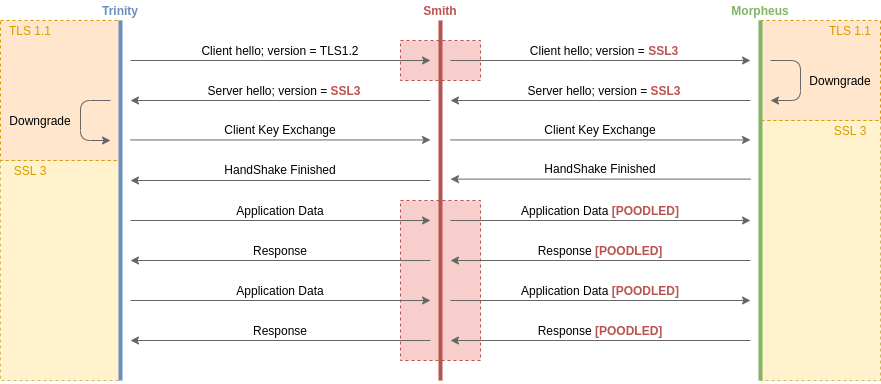

# Proof of concept: POODLE

Ce dépôt contient une preuve d'exploitation de l'attaque **POODLE**. Cette
attaque permet de [décrypter](https://chiffrer.info/) une communication chiffrée
avec TLS. Elle s'appuie sur un enchainement de plusieurs vulnérabilités qui
touchent les serveurs web dont la version de TLS est **inferieur à 1.3**.

Organisation du README:
* [Preuve d'exploitation](https://github.com/0b11stan/poodle#preuve-dexploitation)
  - [Le laboratoire](https://github.com/0b11stan/poodle#le-laboratoire)
    * [Etape 1 : Construction de l'infra](https://github.com/0b11stan/poodle#etape-1--construction-de-linfra)
    * [Etape 2 : Connection aux machines](https://github.com/0b11stan/poodle#etape-2--connection-aux-machines)
    * [Etape 3 : Configurer les réseau](https://github.com/0b11stan/poodle#etape-3--configurer-les-r%C3%A9seau)
    * [Destruction du laboratoire]()
  - [Exploitation]()
    * [Padding Oracle]()
      - [Présentation de la vulnérabilité]()
      - [Demonstration de l'exploitation]()
    * [Downgraded Legacy Encryption]()
      - [Présentation de la vulnérabilité]()
      - [Demonstration de l'exploitation]()
* [Mitigation]()
* [Achivements]()
* [Ressources]()

Le fonctionnement de POODLE est parfaitement illustré par son nom qui est
l'acronyme de "**P**adding **O**racle **O**n **D**owngraded **L**egacy
**E**ncryption". Lors d'une attaque par homme du milieux, l'attaquant peut
"voir" tout le trafic de sa victime. Ce type d'attaque est très fréquent et
est facilité par de nombreuses vunérabilités au niveau des couches physiques et 
de liaison de données. Ces vulnérabilités sont difficiles à corriger pour des
raisons d'interopérabilité entre les réseaux à l'échelle d'internet. Ainsi,
cela fait maintenant plusieurs décénnies que les concepteurs d'applications ne 
se reposent plus sur les couches inferieurs pour assurer la confidentialité des
données échangées. Des protocoles de chiffrement comme SSL/TLS sont aujourd'hui
les seuls rempares efficaces contre les attaques par homme du milieux.

L'enjeux pour un attaquant est donc de déjouer ces méchanismes de
chiffrement de niveau applicatif et c'est ici que POODLE intervient puisqu'elle
a pour objectif de permettre, par une attaque "en ligne", le déchiffrement des
données encapsulées par le protocole TLS.

Cette attaque fonctionne souvent en 3 temps:
1. Mettre en place une attaque par homme du milieux au niveau réseau.
2. Dégrader le niveau de sécurité d'une connexion tls en forcant une version
   ancienne du protocole.
3. Utiliser une attaque de cryptanalyse (Padding Oracle) sur la version SSL/TLS
   dégradée qui est alors vulnérable.

## Preuve d'exploitation

Pour expliquer l'exploitation de cette attaque, nous avons préparer un labo
qui simule un scénario classique mettant en scène l'attaque. Le labo utilise
[docker](https://docs.docker.com/get-started/overview/) pour virtualiser le
réseau et les machines et [make](https://www.gnu.org/software/make/) pour
automatiser la construction du labo.

On utilisera également [openssl](https://github.com/openssl/openssl) pour
simuler les clients et serveurs SSL/TLS et [scapy](https://scapy.net/) pour
réaliser l'attaque.

### Le laboratoire

**TL;DR:**
* `make prepare` dans un premier terminal
* `make morpheus` dans un deuxième terminal
* `make smith` dans un troisième terminal
* `make trinity` dans un quatrième terminal
* `make network` dans le premier terminal
* _be nasty_
* `make clean` une fois qu'on à fini de jouer pour tout supprimer

Trinity et Morpheus sont deux pirates informatiques réputés. En mission dans la
matrice, Trinity a besoin d'envoyer des informations sensibles au dernier camp
humain à l'exterieur de la matrice (Zion). Avant d'envoyer ses informations à
Morpheus, elle s'inquiète de la sécurité de leur canal de communication mais il
la rassure en lui indiquant qu'ils chiffreront leurs échanges avec la dernière
version de TLS à leur disposition: TLS 1.2. De son côté, l'Agent Smith qui a un
accès privilégié au réseau de la matrice à entrepris une attaque par homme du
milieu. Il doit donc trouver un moyen de décrypter la connexion TLS s'il veut
connaitre le contenu de la communication.


Le labo simulera les machines de nos 3 protagonistes:

`morpheus`: La machine de morpheus expose un serveur supportant le protocole
            ssl/tls pour chiffrer les échanges. Il contient une paire de clefs
            asymétriques générés par morpheus. Son serveur est connecté sur le
            réseau de Zion et peut communiquer avec les machines du réseau de la
            matrice à travers un routeur.

`trinity`: La machine de trinity à un client ssl/tls. Le certificat de morpheus
           contenant sa clef publique y est installé. Sa machine est connectée 
           au réseau de la matrice mais peut communiquer avec le réseau de Zion
           en passant par un routeur de la matrice.

`smith`: L'agent smith a pris le contrôle du routeur de la matrice qui fait le
         lien entre le serveur de morpheus et la machine de trinity. Il est en
         capacité de décoder tout le trafic qui transite entre les deux
         pirates mais ne peut pas déchiffrer le flux TLS n'ayant pas accès à la
         clef privé de morpheus.


Pour s'assurer que `trinity` et `morpheus` puissent communiquer malgré
d'éventuelles différences de configuration, les deux machines peuvent s'adapter
à la version de SSL/TLS proposé par l'autre. L'agent Smith est au courant de
cette fonctionnalité qui peut jouer en sa faveur.

#### Etape 1 : Construction de l'infra

La commande `make prepare`, jouée à la racine du dépôt, s'assure d'abord que
toute trace d'une ancienne execution du labo a été supprimé. Une paire
certificat/clef privée est ensuite générée et sera utilisée plus tard pour
chiffrer la communication avec TLS.

Une fois les clefs générés, les machines `trinity` et `morpheus` sont
construites. On peut se rendre compte dans le fichier [Dockerfile](./Dockerfile)
que ces machines reposent sur la même image `openssl-ssl3` qui permet en fait de
réinstaller openssl en activant le protocole ssl3 qui est désactivé par défaut.
C'est la ligne 9 qui est vraiment intéressante et modifie les options de build
d'openssl:
```Dockerfile
RUN sed -i 's/no-ssl2 no-ssl3/enable-ssl3/' /_apt/openssl-1.0.1t/debian/rules
```

Sur la machine `smith` on installe **scapy** pour pouvoir analyser le réseau et
le paquet python **cryptographie** nécessaire à scapy pour pouvoir décoder le
protocole SSL/TLS.

Enfin, les réseaux `zion` et `matrix` sont créés.

#### Etape 2 : Connection aux machines

Cette étape permet d'obtenir un shell dans chacune des machines décrites plus
tôt. Pour cela, on va jouer les commandes suivantes à la racine du dépôt
(chacunes dans un terminal différent):

`make morpheus`:
* Démarre une machine à partir de l'image `morpheus` construite plus tôt.
* Ajoute cette machine dans le réseau `zion`.
* Renvoie un shell interactif bash au sein de cette machine.

`make smith`:
* Démarre une machine à partir de l'image `smith` construite plus tôt.
* Ajoute cette machine dans le réseau `matrix`.
* Renvoie un shell interactif bash au sein de cette machine.

`make trinity`:
* Démarre une machine à partir de l'image `trinity` construite plus tôt.
* Ajoute cette machine dans le réseau `matrix`.
* Renvoie un shell interactif bash au sein de cette machine.

Une fois ces trois machines démarrées, on peut constater que `trinity` peut ping
`smith` mais pas `morpheus`. Pour l'instant, morpheus n'est tout simplement pas
connecté à la matrice.

#### Etape 3 : Configurer les réseau

La commande `make network` (executée à la racine du dépôt) permet de finaliser
la configuration du labo. Elle ajoute `smith` dans le réseau `zion` et configure
les règles de routages de `trinity` et `morpheus` pour faire de `smith` leur
routeur intermédiaire. A partir de ce moment, `smith` est dans une position
d'homme du milieu. On peut s'en persuader en jouant les commandes suivantes:
```
root@smith:~# tcpdump icmp
root@morpheus:~# ping -c 1 trinity
```

A partir de maintenant, le labo est correctement configuré pour y réaliser
l'attaque POODLE.

#### Destruction du laboratoire

Pour supprimer toutes les machines et réseaux créés, jouer simplement la
commande `make clean` à la racine du dépôt.

### Exploitation

Comme expliqué auparavant, `smith` est déjà en situation d'homme du milieu dans
ce labo. Nous présenterons dans un premier temps le fonctionnement de l'attaque
cryptographique "Padding Oracle" pour décrypter un trafic chiffré avec SSLv3.
Nous verrons ensuite comment forcer `morpheus` et `trinity` à utiliser cette
version vulnérable alors même qu'ils préférent tous les deux une version plus
récente du protocole.

#### Padding Oracle

Voyons dans un premier lieu comment fonctionne l'attaque de padding Oracle
sur SSLv3. Pour tester cette attaque nous allons utiliser une connection
volontairement forcée en SSLv3 des deux côtés.

Dans la machine `morpheus`, démarrer un serveur SSLv3:
```bash
openssl s_server \            # on veut démarrer un serveur avec openssl
  -key /root/poodled.key \    # on fournis le chemin de la clef privée
  -cert /root/poodled.crt \   # on fournis le chemin de la clef publique
  -ssl3 \                     # le serveur ne connaitra QUE SSLv3
  -accept 443 \               # le serveur écoutera sur le port 443
  -www                        # il agira comme un serveur web
```

Dans la machine `trinity`, on initie une connection au serveur:
```bash
openssl s_client \        # on veut démarrer un client
  -ssl3 \                 # le client ne connaitra QUE SSLv3
  -connect morpheus:443   # on veut se connecter à morpheus sur le port 443
```

_TODO : exploitation incoming (trace1, trace2) ..._

#### Downgraded Legacy Encryption

##### Présentation de la vulnérabilité

Ici nous allons nous intéresser sur la méthode à utiliser pour dégrader la
version de TLS dans la communication entre `trinity` et `morpheus`.

D'abord, vérifions que `trinity` accepte bien de dégrader sa connection sur
demande de `morpheus`. Sur la machine de Morpheus on démarre un serveur qui
refuse les protocoles les plus récents, ne laissant que SSLv3 de disponible.
```
root@morpheus:~# openssl s_server -key /root/poodled.key -cert /root/poodled.crt -accept 443 -www -no_tls1_2 -no_tls1_1 -no_tls1
Using default temp DH parameters
Using default temp ECDH parameters
ACCEPT
```

On peut analyser en parallèle toute le trafic depuis `smith` en utilisant
scapy en mode interractif (commande `scapy3` dans le shell de `smith`):
```python
load_layer('tls')

def capture(pck):
    wrpcap('/tmp/server_downgrade.pcap', pck, append=True)
    pck["TCP"].show()

sniff(iface="eth1", filter="tcp", prn=lambda p: capture(p))
```

Si `trinity` tente de réaliser une connexion sécurisée sur `morpheus` en ne
spécifiant aucune option spécifique, on peut constater que la connexion sera
correctement établie mais utilisant le sslv3.
```
root@trinity:~# openssl s_client -connect morpheus:443
CONNECTED(00000003)
depth=0 CN = morpheus
verify return:1
---
Certificate chain
 0 s:/CN=morpheus
   i:/CN=morpheus
---
Server certificate
-----BEGIN CERTIFICATE-----
MIIDBzCCAe+gAwIBAgIUUzUL9khTt2GxSYH7oUMz22pg6RkwDQYJKoZIhvcNAQEL
  ...
llc6QASPp+jprWpKLm4hIEvmZtR1Gk+GOy3W8P+XcPfakK/x2Yb2yu3rKIJRm/ge
7zY5koBKIhXU4es=
-----END CERTIFICATE-----
subject=/CN=morpheus
issuer=/CN=morpheus
---
No client certificate CA names sent
---
SSL handshake has read 1313 bytes and written 439 bytes
---
New, TLSv1/SSLv3, Cipher is ECDHE-RSA-AES256-SHA
Server public key is 2048 bit
Secure Renegotiation IS supported
Compression: NONE
Expansion: NONE
SSL-Session:
    Protocol  : SSLv3
    Cipher    : ECDHE-RSA-AES256-SHA
    Session-ID: 24B3C1DFE52D4CA8200A205036020786E34F1DD3D9EE95770FCA10F7F13BA20C
    Session-ID-ctx: 
    Master-Key: D69C0F2492859CEECEAB6CA3486C91324EDC716181B9D6E1A31F144C31C926CD30EFAA9943004DE26804FC64619A0BA6
    Key-Arg   : None
    PSK identity: None
    PSK identity hint: None
    SRP username: None
    Start Time: 1609353992
    Timeout   : 300 (sec)
    Verify return code: 0 (ok)
---
```


Pour constater plus directement le changement de protocole qui a eu lieu, nous
pouvons nous référer au fichier
[server_downgrade.py](./captures/server_downgrade.py) (format text) ou au
fichier [server_downgrade.pcap](./captures/server_downgrade.pcap) (à ouvrir dans
wireshark). On y voit que le handshake initié par `trinity` ( **Client Hello** )
demande bien la version TLS1.2 du protocole mais que `morpheus` répond en
proposant le protocole SSL3.0 ( **Server Hello** ).

De la même façon, nous pouvons vérifier que le serveur acceptera de dégrader sa
connexion si le client se présente avec le protocole SSLv3 (voir
[client_downgrade.py](./captures/client_downgrade.py) ou
[client_downgrade.pcap](./captures/client_downgrade.pcap) ).

##### Démonstration de l'exploitation

Pour exploiter cette vulnérabilité il suffit d'écrire un script python qui
suivra ces spécification:

1. Intercepte et bloque les **"Client Hello"** de `trinity`.
2. Modifie la version du protocole dans le paquet pour la passer à SSLv3.
3. Transmet le paquet à `morpheus`.



Le serveur imaginera que le client ne supporte pas de versions plus récentes de
TLS et renverra un **"Server Hello"** pour SSLv3. De son côté, le client pensera
que c'est le serveur qui ne supporte pas TLS et reverra ses ambitions
cryptographiques à la baisse comme dans les exemples précédents.

_TODO: exploitation incoming..._

## Mitigation

Cette attaque fut extrêmement sensible et d'une efficacité redoutable. Les
réponses ont été multiples pour corriger la vulnérabilité et des efforts de la
communauté à tous les niveaux ont permis une sécurité en profondeur qui rend
cette attaque de moins en moins probable sur la grande majorité des
applications:

* Les développeurs de serveur web (apache, nginx, ...) ont ajouté des options
  permettant de choisir, aux moyens d'une liste blanche, les versions de TLS que
  leur produit pourrait accepter obligeant les administrateurs à spécifier
  explicitement le niveau de sécurité de leurs serveurs en fonction du niveau
  d'intéropérabilité nécessaire.
* Les développeurs de client web (curl, firefox, chrome, ...) ont durci les
  options par défaut, ajoutant la possibilité de limiter l'étandue des versions
  accepté et affichant souvent des messages d'avertissement lorsqu'un protocole
  particulièrement vieux est utilisé.
* Les développeurs des librairies de cryptographie (openssl, libressl, ...), sur
  lesquelles les programmes cités auparavant s'appuient, ont souvent déprécié
  les protocoles en question au sein même du code source, obligeant une
  reconstruction des librairies pour utiliser les versions vulnérables du
  protocole.

## Achivements

- [x] simulter un réseau MITM avec docker
- [x] sniffer le trafic ssl/tls avec scapy
- [x] downgrade les versions pour pouvoir faire du sslv3
- [x] désactiver les sécurités pour rendre le labo vulnérable
- [x] générer un trafic vulnérable avec openssl
- [ ] dev un script capable de modifier le trafic ssl/tls avec scapy
- [ ] utiliser le script pour réaliser un downgrade de version de tls
- [ ] implémenter l'attaque padding oracle sur AES CBC

## Ressources

* [SSLv3 Poodle Vulnerability | Password theft](https://www.youtube.com/watch?v=BbwC8f_aBMQ)
* [Downgrade OpenSSL to support SSLv3](https://devcondition.com/article/debian-10-downgrade-openssl/)
* [Exploiting The SSL 3.0 Fallback](./ssl-poodle.pdf)
* [Testing TLS_FALLBACK_SCSV](https://dwradcliffe.com/2014/10/16/testing-tls-fallback.html)
